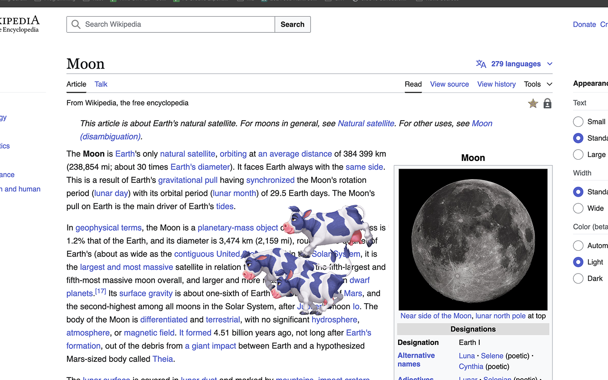
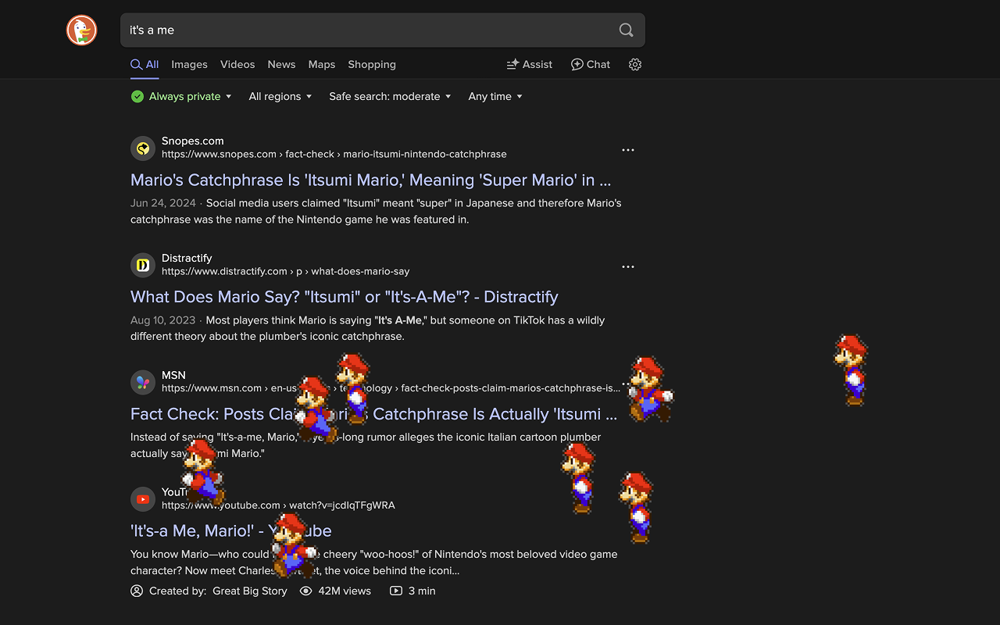
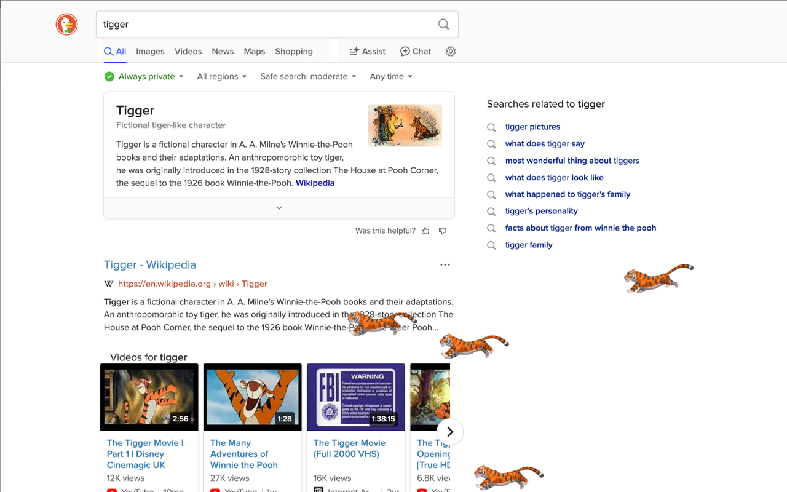

# Spriteverse: Bring nature to your browser 🐅 🐟🐦
Let some members of the sprite kingdom pay you a visit in Chrome.

Configure sprites from run, fly, or crawl (?) in the browser. Install for yourself to get a nice laugh or remind yourself to reset and look outside. Install for a friend to make them confused why there are ants crawling across their screen. 

Configurable to only run at particular intervals or dates, like April fools...

## Demos
### Cows jump over the moon

### It's a me!

### Who's the real tigger?

### They didn't want pasta anyway

### Sometimes, you just need a throwback

## Getting Started
1. Download the Chrome extension
2. Configure your sprites
3. Wait for the sprites to arrive!